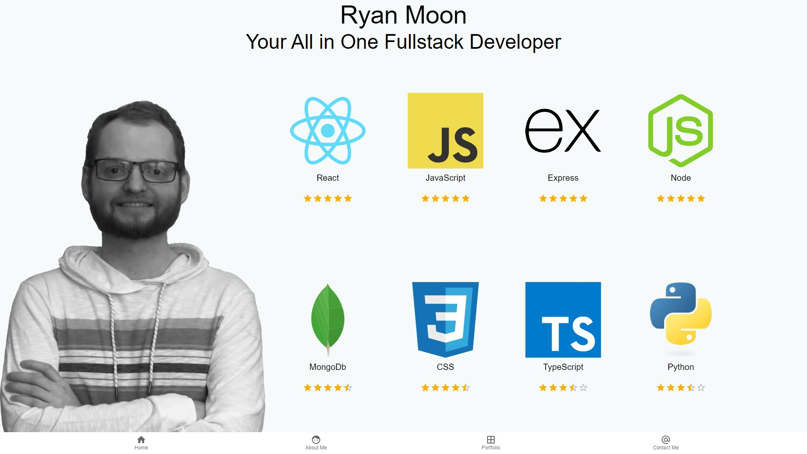

# RyanMoon.xyz


## Description

Portfolio website for Ryan Moon

## Table of Contents

* [Installation](#installation)
* [Usage](#usage)
* [Credits](#credits)
* [Questions](#questions)


## Installation

clone the repo and run ```npm install``` or ```yarn```


## Usage

run ```npm start``` to launch the React application on localhost. This website is currently deployed on my linode server [HERE](ryanmoon.xyz)



## Credits

Material UI, React


## Questions

Find me on github here: [here](http://github.com/moonryc)

If you have any additional question feel free to email me at [rycmoon@gmail.com](mailto:rycmoon@gmail.com)
